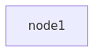

#  Demo 1

The aim of this demo is to introduce you to container-based infrastructure and how you can use Docker Compose for setting up and running *"virtual machines"* (containers) on your computer. In order to be able to run it, you must follow the instructions given in the main [README.md](../README.md#installation) file.

## Running the demo

To run the demo, open the terminal (on Windows the WSL2 terminal), go to the `demo-1` directory and enter: `make start`.

You can check the status with `make status`.

If you prefer a more OS-independent wrapper, you can use Taskfile (install `task` once and then run `task start`). All commands are identical on Windows, Linux, and macOS when using `task`.

As show on the following deployment diagram, the created and started infrastructure is very simple, consisting just of a single node:

## Deployment diagram

*Picture 3: Deployment diagram of Demo 1*

## Accessing the running node (container)

If you want to access the `node1`, just use the command `make shell`.

## Managing the nodes

With **Docker Compose** you can easily manage the whole infrastructure. The basic commands are:

* `make start` - start the infrastructure
* `make stop` - stop the infrastructure 
* `make destroy` - dispose the infrastructure (and stop if running)
* `make graph` - generate the topology diagram source (`topology.mmd`) from the current `docker-compose.yml`
* `make graph-render` - render the diagram to `images/demo-1-deployment.png` (downloads a renderer image on first run)

Note: `graph` uses Python. If the `python` command is missing on your system, install Python 3 and rerun (or adjust the task to use `python3`).

## The docker-compose.yml

The whole infrastructure is described in one file, the `docker-compose.yml`. It describes what nodes are created from prefabricated images and their configuration and is supposed to be committed to a version control system.

## Bind mounts
**Bind mounts** allow you to access the host system's file system from within the container. Official [bind mounts doc](https://docs.docker.com/storage/bind-mounts/).

## The kiv-ds-docker image

All examples/demos in this repository use the [kiv-ds-docker](https://github.com/maxotta/kiv-ds-docker) image as a base for the nodes. It's not neccesary to have a deep knowledge of Docker, but some basic knowledge will help you to better understand how the examples work.
For more information, read the [Official Docker Guides](https://docs.docker.com/get-started/overview/).

## Cleanup

 If you think you've played enough with this demo, just run the `make destroy` command. This command stops the whole infrastructure and removes all related artifacts on your local drive (downloaded and created images which may occupy significant space on your drive).

---