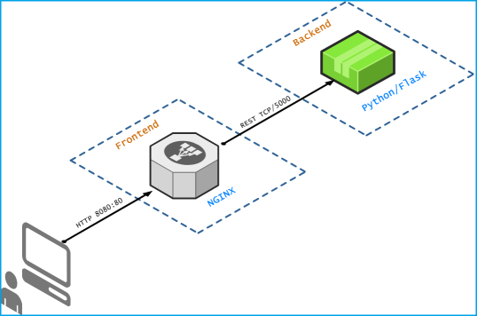
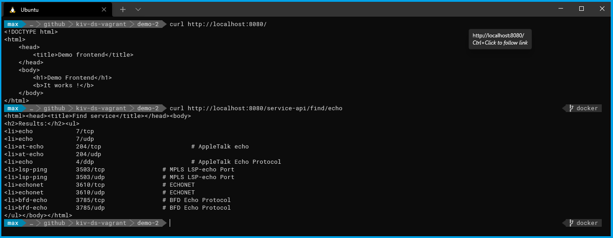
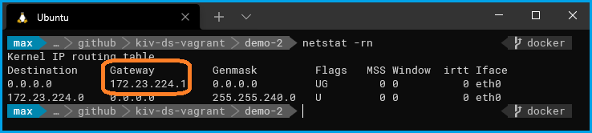
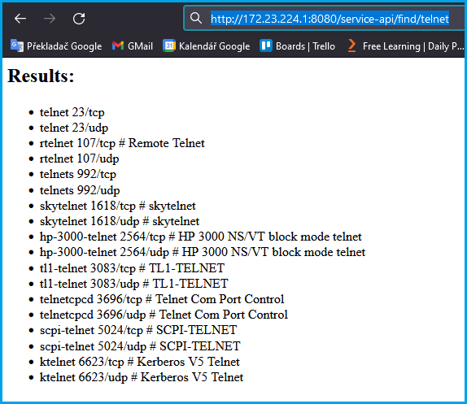

#  Demo 2

The aim of this demo is to show how to:
* spin up 2 nodes using Docker Compose
* how to build your own Docker images by extending the prepared Docker base image [kiv-ds-docker](https://github.com/maxotta/kiv-ds-docker/pkgs/container/kiv-ds-docker) and use them in you own projects
* how to map container ports
* how to access applications/services running inside containers

## Deployment diagram

*Picture 1: Deployment diagram of Demo 2*

## Running the demo

Just enter `task start` in the `demo-2` directory and wait until all nodes start up.

If you want to see which containers are currently running with some additional information, type the command `task status`.

## Managing the nodes

With **Docker Compose** you can easily manage the whole infrastructure. The basic commands are:

* `task start` - start the infrastructure
* `task stop` - stop the infrastructure 
* `task destroy` - dispose the infrastructure (and stop if running)
* `task graph` - generate the topology diagram source (`topology.mmd`) from the current `docker-compose.yml`

Note: `graph` uses Python. If the `python` command is missing on your system, install Python 3 and rerun (or adjust the task to use `python3`).

## Accessing the deployed service

 In order to access the deployed services through the frontend web-server, you need to know how the container ports are mapped to the host. The `task status` command's output shows, that the **frontend** container port **80/tcp** is mapped to port **8080/tcp**,
so we access the service via **http://localhost:8080**:

*Picture 2: Accessing Demo-2 service from the host machine*

## Accessing the deployed services on Windows outside from WSL2

The previous instructions work on Linux and inside the WSL2 environment on Windows. If you want to access the service from a web browser running on the Windows host machine, you need to know through which interface to access the WSL2 VM. You can figure this out by looking at the routing table inside WSL2:

*Picture 3: Figuring out the IP address of the WSL2 VM on Windows*

Now, when you know the IP address, you can access the service also from outside WSL2 - just replace **localhost** with the IP address in the URLs shown in the above examples:

*Picture 4: Accessing the service with a browser from outside the WSL2 VM*
 
 ## Cleanup

 If you think you've played enough with this demo, just run the `task destroy` command.

---

