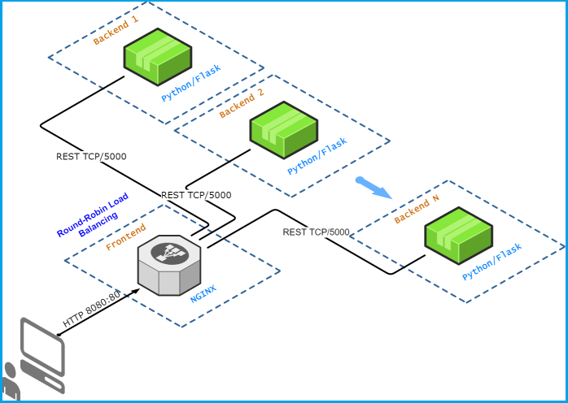
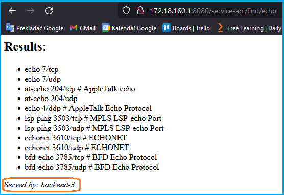

#  Demo 3

The aim of this demo is to show how to:
* create and start nodes/containers programmatically
* generate configuration files before startup
* how to create configuration files using a simple script

## Deployment diagram

*Figure 1: Deployment diagram of Demo 3*

## Running the demo

Just enter `task start` in the `demo-3` directory and wait until all nodes start up.

With the command `task status` you can see what containers are currently running.

The load-balancer config and `docker-compose.yml` are generated before the containers start (see `task prepare`).

If everything is running (frontend and N backends), you can verify how the configured round-robin load balancing in [NGINX](https://www.nginx.com/) works. Point your browser to the frontend URL [(see Demo-2 how to access the frontend)](../demo-2#accessing-the-deployed-service). You should see the same page as in Demo-2, but with a small difference: at the bottom is an information which backend served your request. As you hit the *Reload button* on your web browser, each time the request will be served by another backend in a *round robin way*.

*Figure 2: Verifying load balancing with a web browser*

## Managing the nodes

With **Docker Compose** you can easily manage the whole infrastructure. The basic commands are:

* `task prepare` - generate the load balancer config (`frontend/config/backend-upstream.conf`)
* `task start` - start the infrastructure
* `task stop` - stop the infrastructure 
* `task destroy` - dispose the infrastructure (and stop if running)
* `task graph` - generate the topology diagram source (`topology.mmd`) from the current `docker-compose.yml`
* `task graph-render` - render the diagram to `images/demo-3-deployment.png` (downloads a renderer image on first run)

Note: `graph` uses Python. If the `python` command is missing on your system, install Python 3 and rerun (or adjust the task to use `python3`).

## Backend count

The number of backend nodes is controlled by the `BACKENDS` variable in `Taskfile.yml`. To change it, run for example:

`task start BACKENDS=3`

 ## Cleanup

 If you think you've played enough with this demo, just run the `task destroy` command.

---

